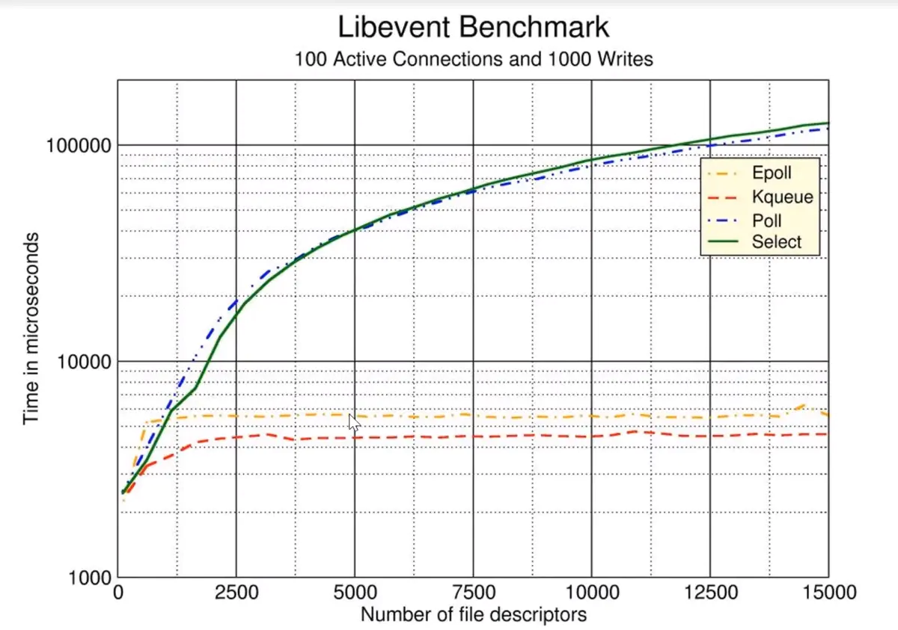

# Socket 编程发展

## 一，什么是 Socket？

### 1，Socket 一词的起源

> Socket 一词的起源
在组网领域的首次使用是在 1970 年 2 月 12 日发布的文献 [IETF RFC33](http://datatracker.ietf.org/doc/rfc33/) 中发现的，撰写者为 Stephen Carr、Steve Crocker 和 Vint Cerf。根据美国计算机历史博物馆的记载，Croker 写道：“命名空间的元素都可称为套接字接口。一个套接字接口构成一个连接的一端，而一个连接可完全由一对套接字接口规定。” 计算机历史博物馆补充道：“这比 BSD 的套接字接口定义早了大约12年。”

Socket 起源于 Unix，而 Unix/Linux 基本哲学之一就是 **“一切皆文件”**，而文件就可以用 “打开（open） ----> 读写（write/read） ----> 关闭（close）” 模式来操作。Socket 可以理解为该模式的一个实现，**即 Socket 是一种特殊的文件**。网络中的两个端点借助该文件可以实现网络通信。Socket 的相关函数就对应于通信过程中的各种操作（如，打开、读/写 IO、关闭）。

### 2，百度百科上的 [Socket 词条](https://baike.baidu.com/item/套接字/9637606)

所谓套接字 (Socket)，就是对网络中不同主机上的应用进程之间进行双向通信的端点的抽象。一个套接字就是网络上进程通信的一端，提供了应用层进程利用网络协议交换数据的机制。从所处的地位来讲，套接字上联应用进程，下联网络协议栈，是应用程序通过网络协议进行通信的接口，是应用程序与网络协议进行交互的接口。

### 3，Socket 在哪里？

上面的词条告诉我们：Socket 是应用层与 TCP/IP 协议族通信的中间软件抽象层，它是一组接口，并不是协议。那么它在哪里呢？引用一张图片所示：


(图片来自 [Socket 通信原理](https://www.cnblogs.com/wangcq/p/3520400.html))

在设计模式中，Socket 其实就是一个门面模式，它把复杂的 TCP/IP 协议族隐藏在 Socket 接口后面，对用户来说，一组简单的接口就是全部，让 Socket 去组织数据，以符合指定的协议。

### 4，Socket 一词的翻译

#### (1)，插座


英文单词 Socket，为插座，插孔的意思。如果两个机子要通信，中间要通过一条线，这条线的两端要连接通信的双方，这条线在每一台机子上的接入点则为 Socket，即为插孔，所以在通信前，我们在通信的两端必须要建立好这个插孔，同时为了保证通信的正确，端和端之间的插孔必须要一一对应，这样两端便可以正确的进行通信了，而这个插孔对应到我们实际的操作系统中，就是 Socket 文件，我们在创建它之后，就会得到一个操作系统返回的对于该文件的描述符，然后应用程序可以通过使用套接字描述符访问套接字，可以向其写入数据或从中读出数据。引用自 [Linux下Socket通信（TCP实现）](https://segmentfault.com/a/1190000010838127)。

还有一篇 [【计算机网络】Socket的插座理解法](https://blog.csdn.net/tama1204/article/details/108926617) 可以参考。

> 可以将每一个插头理解为一个 SocketID，两孔插头为 TCP，三孔为 UDP，所有的插头都由管家（内核）保管，每次只能向他申请一个插头。一个主机或服务器只有一个插排（IP地址），上面有很多插孔（port）。


#### (2)，套接口

《Unix 网络编程 卷 I：套接字联网 API (第3版)》第 8 页有一段编者注：

> 译者认为译成“套接口”更为准确，其理由如下：
>
> - 首先，作为网络编程 API 之一的套接口（sockets，注意这种用法总是采用复数形式，如 sockets API，sockets library 等）跟 XTI 一样，是应用层到传输层或其他协议层的访问接口。
> - 其次，具体使用的套接口是与 Unix 管道的某一端类似的东西，我们既可以往这个“口”中写数据，也可以从这个“口”中读数据。
> - 最后，套接口函数使用套接口 **描述字** （descriptor）访问具体的套接口，如果把套接口描述字的简称 sockfd 译成 “套接字” 倒比较合适。
> - 从这个意义上看，一个套接口可以对应多个套接字，因为 Unix 的描述字既可以复制，也可以继承；反过来一个套接字对应且只对应一个套接口。但是，鉴于现在 socket 广泛被接受的译法是 “套接字”，所以本书亦采用了 “套接字” 的译法。相应地，descriptor 也采用了 “描述符” 的译法，而未坚持译为 “描述字”。

## 二，Socket 的发展

### Linux 上 IO 复用的发展
由上面内容可知套接字（Socket）是通信的基石，是支持 TCP/IP 协议的网络通信的基本操作单元。随着日益增大的通信需求，复用技术（multiplexing）应运而生。复用并不是新技术而是一种设计思想，从本质上来说，复用就是为了解决有限资源和过多使用者的不平衡问题，它的理论基础是 **资源的可释放性**。

Linux 系统在服务器市场上有着决定性的占比。在 Linux 平台上如何应对大量连接请求的场景呢？这就需要了解 Unix/Linux 的网络 I/O 模型。

`select`、`poll` 和 `epoll` 是 Linux 上先后出现的 I/O 复用工具，FreeBSD 的 `kqueue` 也是非常优秀的 I/O 复用工具，`kqueue` 的原理和 `epoll` 很类似。`epoll` 最初在 Linux 2.5.44 内核版本出现，后续在 2.6.x 版本中对代码进行了优化，使其更加简洁。此后 `epoll` 在高性能服务器领域得到了广泛的应用。

现在比较出名的 Nginx 就是使用 `epoll` 来实现 I/O 复用支持高并发的，目前在高并发的场景下，Nginx 越来越受到欢迎。

### 高性能 Nginx 服务器端的占比
据 w3techs 在 2015 年 8 月 10 日的统计数据表明，在全球 Top 1000 的网站中，有 43.7% 的网站在使用 Nginx，这使得 Nginx 超越了 Apache，成为了高流量网站最信任的 Web 服务器足足有两年时间。已经确定在使用 Nginx 的站点有：Wikipedia，WordPress，Reddit，Tumblr，Pinterest，Dropbox，Slideshare，Stackexchange 等，可以持续罗列好几个小时，他们太多了。

下图是统计数据：


### 1，select 模型（开拓者）

`select` 大约是 2000 年初出现的，其对外的接口定义如下：

```c
int select(int nfds, fd_set *readfds, fd_set *writefds,
        fd_set *exceptfds, struct timeval *timeout);
```

`select` 函数监视的文件描述符分 3 类，分别是 `writefds`、`readfds` 和 `exceptfds`。

- 调用后 `select` 函数会 **阻塞**，直到有描述符就绪（有数据 可读、可写、或者有 `except`），或者超时（`timeout` 指定等待时间，如果想立即返回，设为 `null` 即可）。
- 当 `select` 函数返回后，通过 **遍历** `fd_set`，来找到就绪的描述符。

`select` 目前几乎在所有的平台上支持，其良好 **跨平台支持** 是一大 **优点**。

`select` 的一个 **缺点** 在于 **单个进程能够监视的文件描述符的数量存在最大限制**，在 Linux 上一般为 1024，可以通过修改宏定义甚至重新编译内核的方式提升这一限制，但是这样也会造成效率的降低。

### 2，poll 模型（加强版）

`poll` 算是 `select` 的加强版，基本原理跟 `select` 类似，`poll` 的接口如下：

```c
int poll(struct pollfd *fds, unsigned int nfds, int timeout);
```

不同于 `select` 使用三个位图来表示三个 `fd_set` 的方式，`poll` 使用一个 `pollfd` 的指针实现。

```c
struct pollfd {
    int fd; /* file descriptor */
    short events; /* requested events to watch */
    short revents; /* returned events witnessed */
};
```

`pollfd` 结构体包含了 **要监视的 `event`** 和 **发生的 `event`**。

- 不再使用 `select` **“参数-值”** 传递的方式。

- 同时，`pollfd` 并没有最大数量限制（但是数量过大后性能也是会下降）。

和 `select` 函数一样，`poll` 返回后，需要 **轮询** `pollfd` 来获取就绪的描述符。

从上面看，`select` 和 `poll` 都需要在返回后，通过遍历文件描述符来获取已经就绪的 `socket`。事实上，同时连接的大量客户端在某一时刻可能只有很少的处于就绪状态，因此随着监视的描述符数量的增长，其效率也会线性下降。

### 3，epoll 模型（继承者）

`epoll` 的接口如下：

```c
int epoll_create(int size);
int epoll_ctl(int epfd, int op, int fd, struct epoll_event *event);

typedef union epoll_data {
    void *ptr;
    int fd;
    __uint32_t u32;
    __uint64_t u64;
} epoll_data_t;

struct epoll_event {
    __uint32_t events;      /* Epoll events */
    epoll_data_t data;      /* User data variable */
};

int epoll_wait(int epfd, struct epoll_event * events, int maxevents, int timeout);
```

主要是 `epoll_create`、`epoll_ctl` 和 `epoll_wait` 三个函数。

- `epoll_create` 函数创建 `epoll` 文件描述符，参数 `size` 并不是限制了 `epoll` 所能监听的描述符最大个数，只是对内核初始分配内部数据结构的一个建议。
- `epoll_ctl` 完成对指定描述符 `fd` 执行 `op` 操作控制，`event` 是与 `fd` 关联的监听事件。`op` 操作有三种：添加 `EPOLL_CTL_ADD`，删除 `EPOLL_CTL_DEL`，修改 `EPOLL_CTL_MOD`。分别对应着添加、删除和修改对 `fd` 的监听事件。
- `epoll_wait` 等待 `epfd` 上的 IO 事件，最多返回 `maxevents` 个事件。

### 4，模型之间的对比

- 在 `select/poll` 中，进程只有在调用一定的方法后，内核才对所有监视的文件描述符进行扫描；

- 而 `epoll` 事先通过 `epoll_ctl` 来注册一个文件描述符，一旦某个文件描述符就绪时，内核会采用类似 `callback` 的回调机制，迅速激活这个文件描述符，当进程调用 `epoll_wait` 时便得到通知。

- Libevent Benchmark 如下图（图片来自网络）：



### 5，`epoll` 模型的优点

主要是以下几个方面：

- 1， **监视的描述符数量不受限制**，它所支持的 `fd` 上限是最大可以打开文件的数目，这个数字一般远大于 2048。

    举个例子， 在 1GB 内存的机器上大约是 10 万左右，具体数目可以使用 `cat /proc/sys/fs/file-max` 命令察看, 一般来说这个数目和系统内存关系很大。

    `select` 的最大缺点就是进程打开的 `fd` 是有数量限制的。 这对于连接数量比较大的服务器来说根本不能满足。虽然也可以选择多进程的解决方案 ( Apache 就是这样实现的)，但这不是一种完美的方案。原因有两方面：
      - 一是，即使 Linux 上面创建进程的代价比较小，但仍是不可忽视的；
      - 二是，进程间数据同步远比不上线程间同步的高效。

- 2， **IO 的效率不会随着监视的 `fd` 数量的增长而下降**。（如上图所示）：
  - `epoll` 不同于 `select` 和 `poll` 轮询的方式，而是通过每个 `fd` 定义的 **回调函数** 来实现的。
  - 只有就绪的 `fd` 才会执行回调函数。

- 3，**支持水平触发和边沿触发两种模式**：

  - 水平触发模式，文件描述符状态发生变化后，如果没有采取行动，它后面将 **反复通知**，这种情况下编程相对简单，libevent 等开源库很多都是使用的这种模式。
  - 边沿触发模式，只告诉进程哪些文件描述符刚刚变为就绪状态，**只说一遍**，如果没有采取行动，那么它将不会再次告知。理论上边沿触发的性能要更高一些，但是代码实现相当复杂（Nginx 使用的边沿触发）。

- 4，**`mmap` 加速内核与用户空间的信息传递。**

  - `epoll` 是通过内核与用户空间 `mmap` 同一块内存，避免了无谓的内存拷贝。


## 参考网址：

- [套接字](https://baike.baidu.com/item/套接字/9637606)
- [Socket通信原理](https://www.cnblogs.com/wangcq/p/3520400.html)
- [linux基于socket网络编程](https://blog.csdn.net/z961968549/article/details/81974028)
- [Linux下Socket通信（TCP实现）](https://segmentfault.com/a/1190000010838127)
- [基于TCP协议的Socket通信(1)](https://www.runoob.com/w3cnote/android-tutorial-socket1.html)
- [【计算机网络】Socket的插座理解法](https://blog.csdn.net/tama1204/article/details/108926617)
