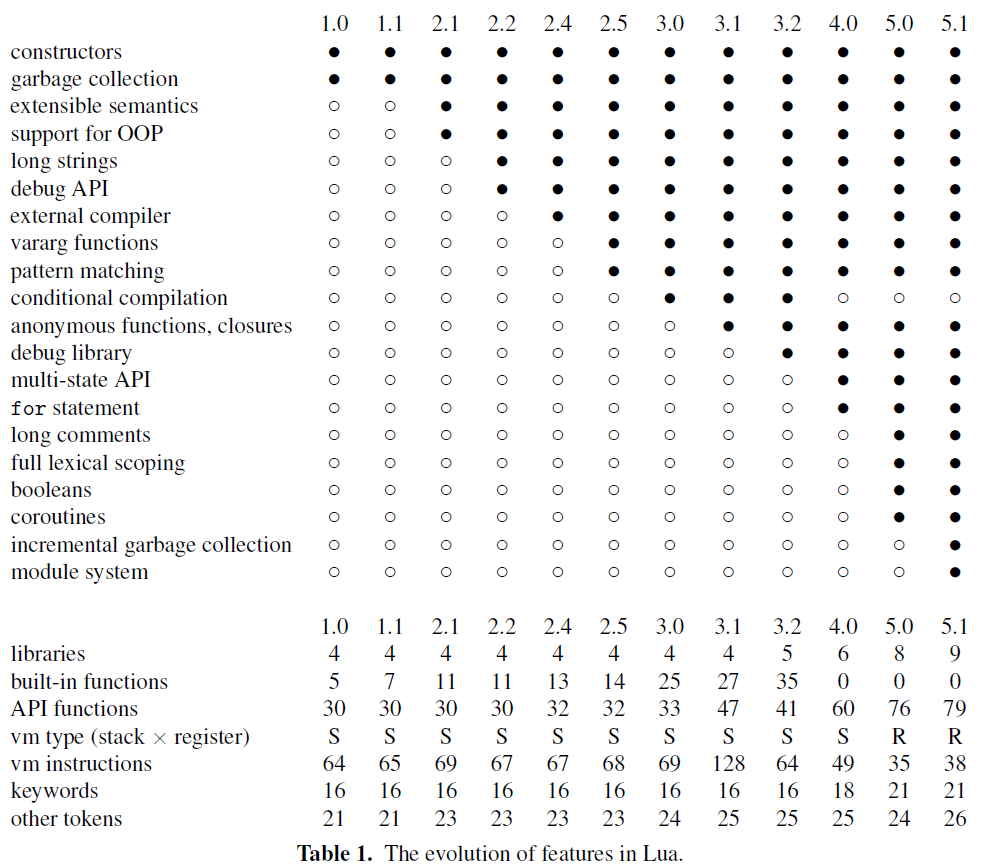

# 第一部分 Lua 和 LuaJIT

这一部分主要介绍 Lua 语言的历史、基本语法、数据类型、唯一的数据结构和标准库以及同步更新的 LuaJIT 项目。章节划分主要参考 Lua 语言的三位作者在 FCRC2007 的第三届 ACM SIGPLAN 编程语言历史会议 (HOPL III) 上发表的关于 Lua 演进的论文 [《The_evolution_of_Lua》](http://www.lua.org/doc/hopl.pdf) 。本部分的子章节都会先介绍演进历史，再介绍基本内容和最佳实践。有兴趣的小伙伴可以访问作者们演讲的 [幻灯片](http://www.inf.puc-rio.br/~roberto/talks/hopl-slides.pdf) 和 [视频 ](http://portal.acm.org/ft_gateway.cfm?id=1238846&type=mov)，更多资源和最新动态可访问 Lua 官网的 [news](http://www.lua.org/news.html) 页面。

另外，在 www.researchgate.net 网站上也可以下载 [《The_evolution_of_Lua》](https://www.researchgate.net/publication/221501769_The_evolution_of_Lua)，还有他们为作者们创建的主页，主页上有作者们发表的文章、注解以及参考，是很优质的学习资料。

网友 [spin6lock](https://github.com/spin6lock) 制作了论文的 [中文翻译](https://github.com/spin6lock/the_evolution_of_lua_zh_CN/blob/master/the_evolution_of_lua.md) 版本，欢迎各位小伙伴参考，一起改进。

先贴一下论文中的 Lua 功能演进图。

这一部分包括的内容如下：

- Lua 部分：
  - 基本语法
  - 8 种数据类型
  - 唯一的数据结构
  - 循环控制
  - 表达式
  - 标准库
- LuaJIT 部分：
  - LuaJIT 的特性
  - 与 Lua 的兼容

Lua 教程和博文资源：

- [The evolution of lua - Lua 发展史](https://blog.csdn.net/lgh1700/article/details/78450262)
- [《The Evolution of Lua 》](https://www.researchgate.net/publication/221501769_The_evolution_of_Lua/link/5465e5140cf2052b50a07423/download)

优质书籍列表：

- 《Lua 设计与实现》
- 《Nginx Lua 开发实战》
- 《Lua 程序设计（第4版）》
- 《自己动手实现 Lua：虚拟机、编译器和标准库》
- 《Nginx 实战：基于 Lua 语言的配置、开发与架构详解》
- 《Lua 5.3 Reference Manual》
- 《Lua 5.3 Bytecode Reference》
- 《The Implementation of Lua 5.0》
- 《Programming in Lua, Fourth Edition》
- 《A No-Frills Introduction to Lua 5.1 VM Instructions》

网站：

- Lua 官网：[http://www.lua.org](http://www.lua.org)
- LuaJIT 官网：[http://luajit.org](http://luajit.org)
- [feistyduck.com](https://www.feistyduck.com/)
